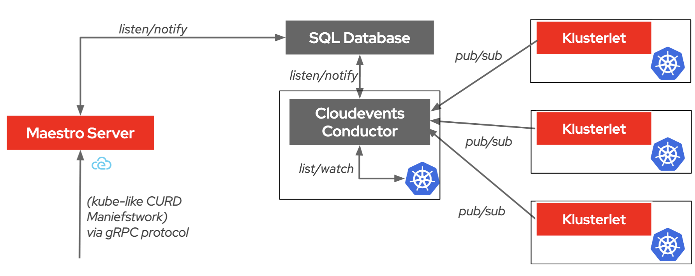

# CloudEvents Conductor
The CloudEvents Conductor is deployed on the hub and exposed to allow connections from managed clusters. It should provide the following features:
- **gRPC Server**: The gRPC server is responsible for handling incoming requests from managed clusters.
- **Router Service**: Routes the requests to the appropriate service based on the source. If the source is kube, then route requests to the Work Service to handle Kube requests. If the source is maestro, then route requests to the DB Service to handle Maestro requests.
- **Consumer Controller**: Maps the managed cluster to the Maestro consumer and calls the Maestro API to create the consumer.

## Overview

The diagram shows how the Cloudevents Conductor acts as a central place, coordinating communication between the SQL Database, Kube Resources, and Klusterlet to manage resources across Kubernetes clusters. The Cloudevents Conductor does not communicate directly with the Maestro server; instead, interactions with Maestro are handled via the SQL Database Listen and Notify mechanism.

