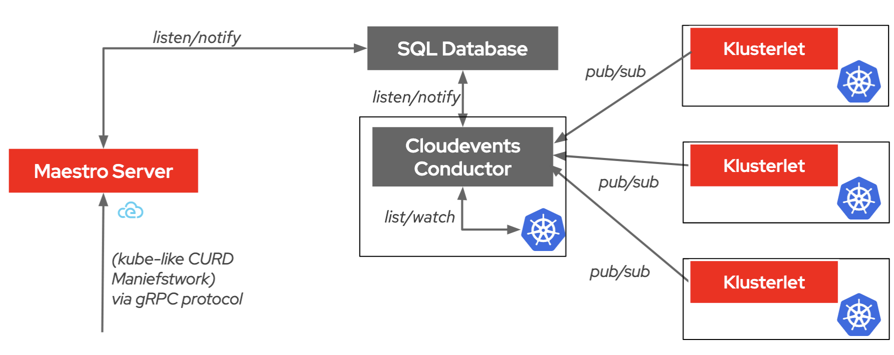

# CloudEvents Conductor
The CloudEvents Conductor is deployed on the hub and exposed to allow connections from managed clusters. It provides the following features:
- **gRPC Server**: Handles incoming requests from managed clusters.
- **Router Service**: Routes requests to the appropriate service based on the source. If the source is `kube`, requests are routed to the Work Service to handle Kubernetes requests. If the source is `maestro`, requests are routed to the DB Service to handle Maestro requests.
- **Consumer Controller**: Maps managed clusters to Maestro consumers and calls the Maestro API to create consumers.

## Overview

The diagram below shows how the CloudEvents Conductor acts as a central hub, coordinating communication between the SQL Database, Kubernetes Resources, and Klusterlet to manage resources across Kubernetes clusters. The CloudEvents Conductor does not communicate directly with the Maestro server; instead, interactions with Maestro are handled via the SQL Database Listen and Notify mechanism.

<p align="center">
    
</p>

## Deploy

### Deploy the `Maestro server` and `cloudevents-conductor` on your ACM hub

Run the following command to deploy Maestro on your ACM hub:

```sh
oc patch mce <your-mce-cr-name> --type=merge \
    -p '{"spec":{"overrides":{"components":[{"name":"maestro-preview","enabled":true}]}}}'

# wait for MCE available
oc get mce -w
NAME                 STATUS        AGE   CURRENTVERSION   DESIREDVERSION
multiclusterengine   Progressing   37m   2.17.0-116       2.17.0-116
multiclusterengine   Progressing   38m   2.17.0-116       2.17.0-116
multiclusterengine   Progressing   38m   2.17.0-116       2.17.0-116
multiclusterengine   Progressing   38m   2.17.0-116       2.17.0-116
multiclusterengine   Available     39m   2.17.0-116       2.17.0-116
```

### Import your managed cluster

1. Create a `KlusterletConfig` on your ACM hub to set the `grpc` type for the `registrationDriver` for cluster registration:

```bash
cat << EOF | oc apply -f -
apiVersion: config.open-cluster-management.io/v1alpha1
kind: KlusterletConfig
metadata:
  name: grpc-config
spec:
  registrationDriver:
    authType: grpc
EOF
```

2. Follow the ACM documentation to import the managed cluster from the ACM console or CLI, and add the annotation `agent.open-cluster-management.io/klusterlet-config=grpc-config` to the `ManagedCluster` resource.

Alternatively, you can add the `grpc` `registrationDriver` `authType` to a global `KlusterletConfig`, and all managed clusters will be imported via `gRPC` by default.
